# 💻 String Calculator TDD Kata — Incubyte Assessment

This repository contains my solution to the **String Calculator TDD Kata** as part of the **Incubyte Software Craftsperson hiring process**.

The solution is built in **JavaScript** using the **Jest** testing framework and follows the **Test-Driven Development (TDD)** cycle strictly:

> 🔴 Write a failing test → 🟢 Make it pass → ♻️ Refactor

---

## 📦 Tech Stack

- Language: **JavaScript (ES6+)**
- Test Framework: **Jest**
- Environment: Node.js v18+

---

## 🚀 Getting Started

### 🔧 Setup

1. Clone the repo  
   `git clone https://github.com/your-username/string-calculator-kata.git`
2. Navigate to project  
   `cd string-calculator-kata`
3. Install dependencies  
   `npm install`
4. Run tests  
   `npm test`

---

## 📋 Features and TDD Test Cases

| #   | Requirement                                                   | Input                                          | Output       | 🔴 Failing Test Screenshot               | 🟢 Passing Test Screenshot               |
| --- | ------------------------------------------------------------- | ---------------------------------------------- | ------------ | ---------------------------------------- | ---------------------------------------- |
| 1   | Empty string returns 0                                        | `""`                                           | `0`          | 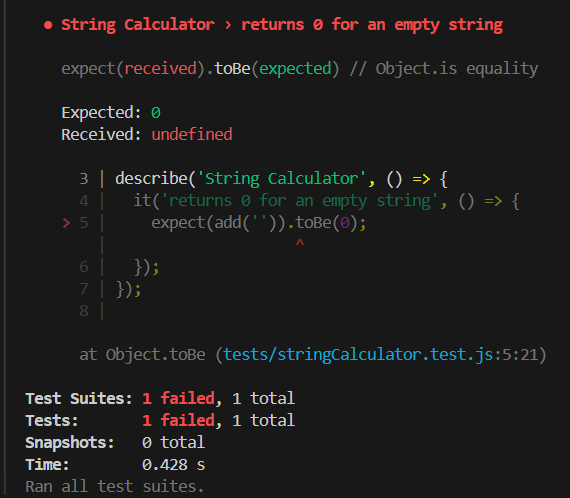  |   |
| 2   | Single number returns the number                              | `"1"`                                          | `1`          | 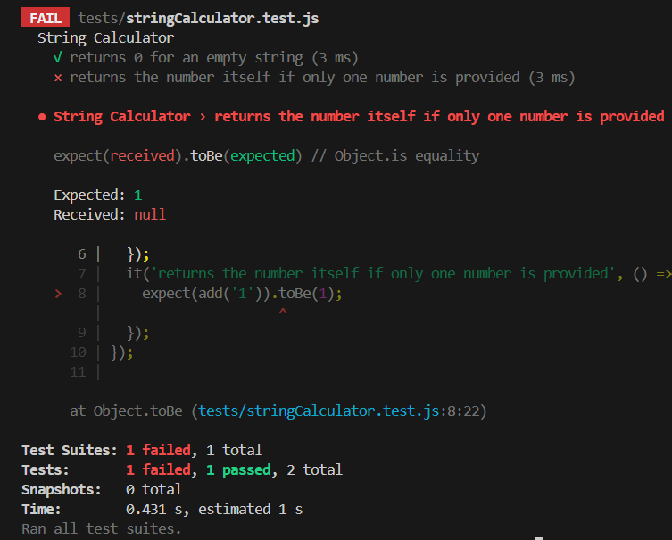  | 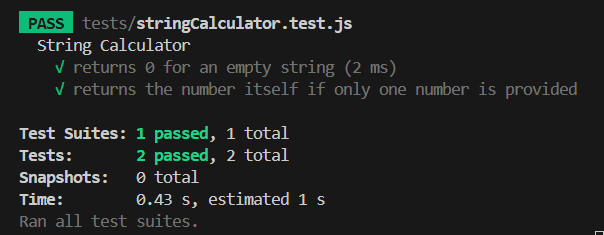  |
| 3   | Two numbers return their sum                                  | `"1,2"`                                        | `3`          |   | 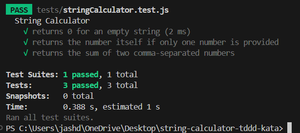  |
| 4   | Multiple comma-separated numbers                              | `"1,2,3,4"`                                    | `10`         | Test did not fail initially              | 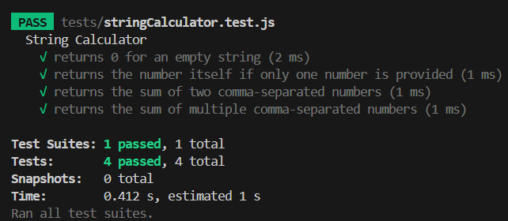  |
| 5   | Support newline `\n` as delimiter                             | `"1\n2,3"`                                     | `6`          |   | 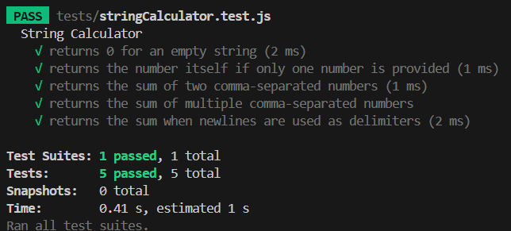  |
| 6   | Custom single-character delimiter                             | `"//;\n1;2"`                                   | `3`          | 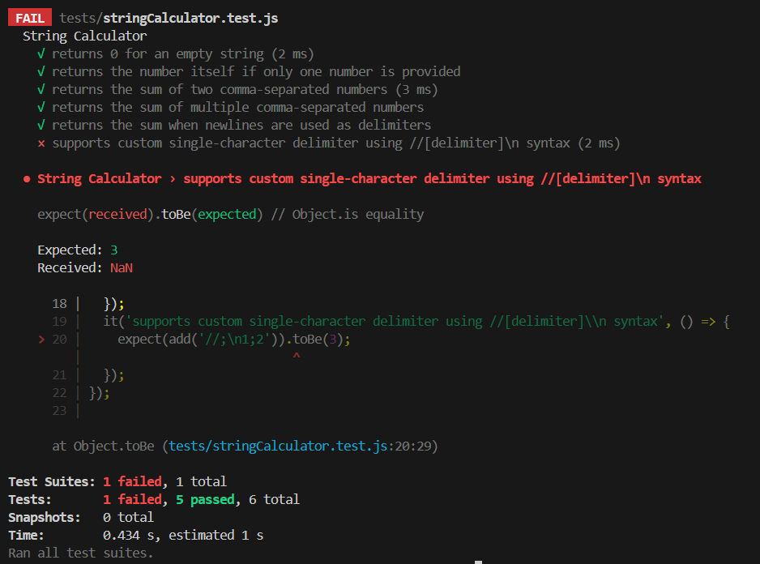  | 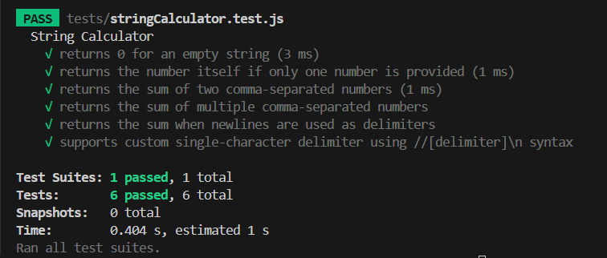  |
| 7   | Exception on one negative number                              | `"1,-2"`                                       | Error        | 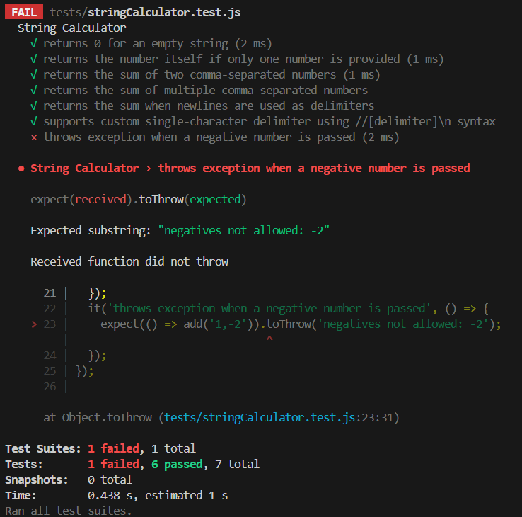  | 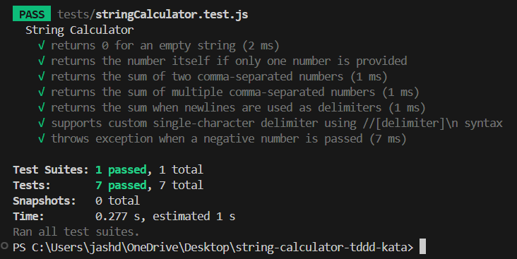  |
| 8   | Exception on multiple negative numbers                        | `"1,-2,3,-5"`                                  | Error        | Test did not fail initially              | 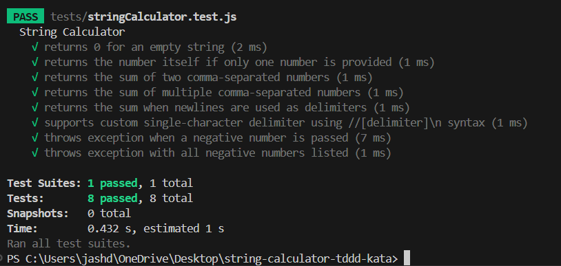  |
| 9   | Ignore numbers >1000 but include 1000                         | `"2,1001"` / `"2,1000"`                        | `2` / `1002` |   | 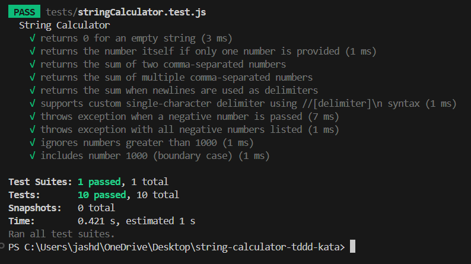  |
| 10  | Support multi-character custom delimiter (e.g. `[***]`)       | `"//[***]\n1***2***3"`                         | `6`          | Test did not fail initially              | 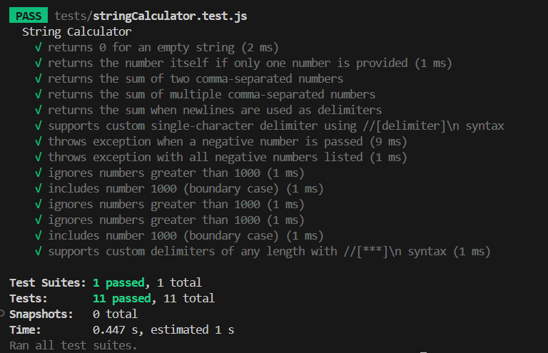 |
| 11  | Support multiple delimiters `[*,%]` and multi-char `[**][%%]` | `"//[*][%]\n1*2%3"` `"//[**][%%]\n1**2%%3"` | `6`          | 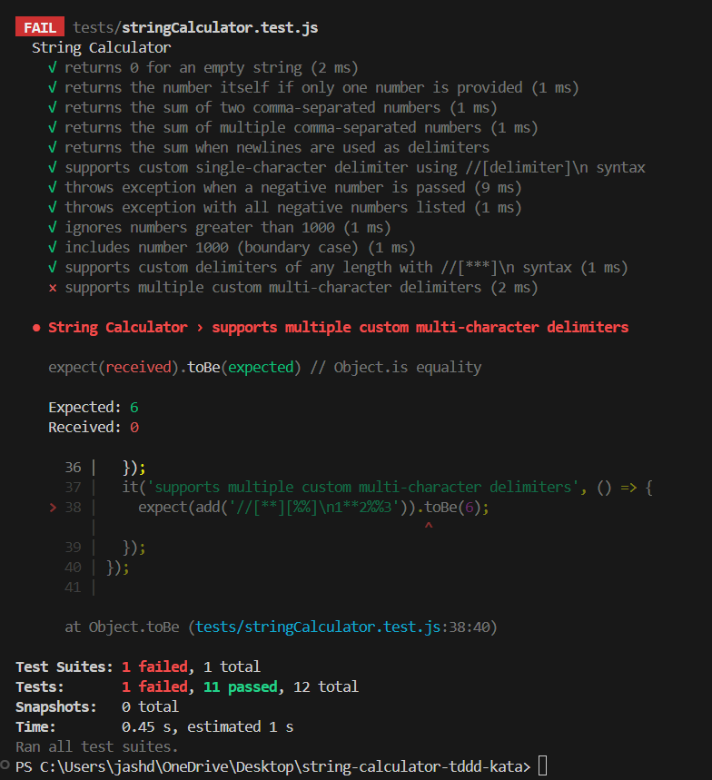 | 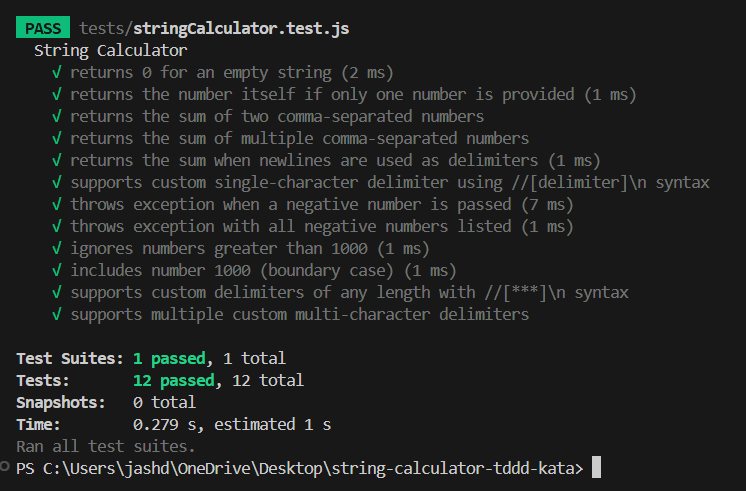 |
